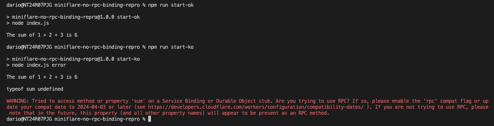

# miniflare-no-rpc-binding-repro

After installing the project's dependencies:
```
$ npm i
```

If you run `npm run start-ok` everything will work as you'd expect it to, `npm run start-ko`
instead shows you that the `sum` function is `undefined` and also triggers a warning from workerd:


> [!NOTE]
> Note that the script is not even trying to run the rpc method,
> but just console logging its type causes the workerd warning to appear